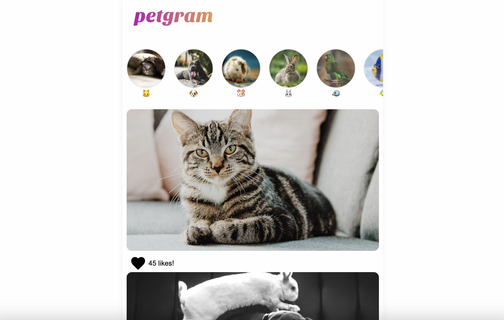

<div align="center">

<br>

   

</div>


A social network for pets, which UI is inspired by instagram. This project uses lazy loading techniques and other features to improve the performance. Also includes a graphql server and some custom hooks. It uses styled components for CSS styles.


### ⚡️ Development
```
npm run dev
```

### 📦 Frontend deployment
```
vercel
```

### 🚀 Backend deployment
```
cd api

vercel
```


### 🧩 Technologies
- React.js
- Vite.js
- Styled Components
- GraphQL/ApolloClient
